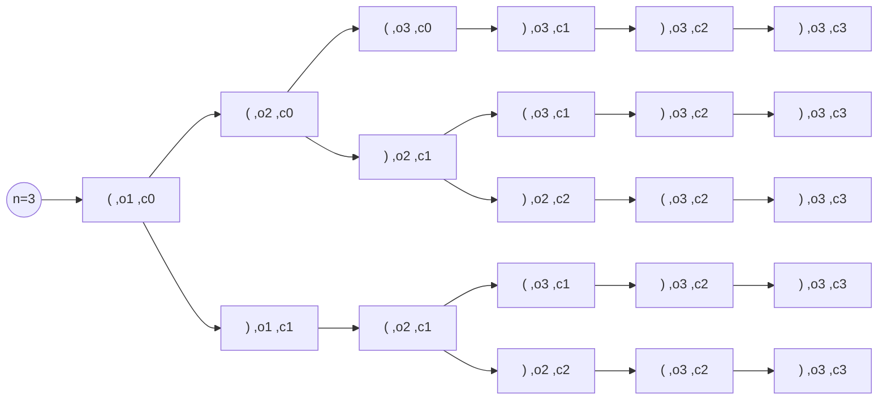

# 22. Generate Parentheses

Given n pairs of parentheses, write a function to generate all combinations of well-formed parentheses.

## Example1:

Input: n = 3\
Output: ["((()))","(()())","(())()","()(())","()()()"]

## Example2:

Input: n = 1\
Output: ["()"]

## Thinking:
- 可以用recursive，然候子問題切分來處理大部份的問題
- 但2+3跟2+2這種case，對於子問題來說有點例外，所以就另外處理他
- 不過這個答案只有5.8% runtime beats，所以應該是我的解法有問題

## 學習:
這題問過claude應該是要用backtrack來解的，用子問題分割會沒有效率.
那就留一下記錄，記得一下我曾經用其它角度寫出了解法

### backtrack 範例n=3：

