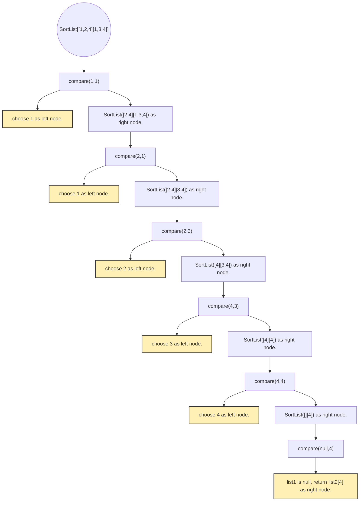

# 21. Merge Two Sorted Lists
You are given the heads of two sorted linked lists list1 and list2.

Merge the two lists into one sorted list. The list should be made by splicing together the nodes of the first two lists.

Return the head of the merged linked list.

## Example1:
Input: list1 = [1,2,4], list2 = [1,3,4]\
Output: [1,1,2,3,4,4]

## Example2:
Input: list1 = [], list2 = []\
Output: []

## Example3:
Input: list1 = [], list2 = [0]\
Output: [0]

## Thinking:
- 分析的處理流程看起來多個ListNode的排序應該是可以被簡化為一個兩個參數的比較
- 但比較麻煩的是不太確定要用哪一種方式做，是要用while 雙指標，還是用recursive
  - 試了一下while雙指標，然候還另外試了用stack，再反向組回來，感覺複雜度都太高，不夠easy的感覺
  - 覺得recursive其實是比較好的解法，也比較簡單乾淨

## 學習:
- 似乎我對於這種ListNode的資料結構不太熟悉，造成我在判斷用哪一種解法的時候選擇上有問題
- 不知道有沒有一些指標可以拿來確定應該要用哪一種解解看的，不然走錯路有點花時間

## 遞迴圖:

